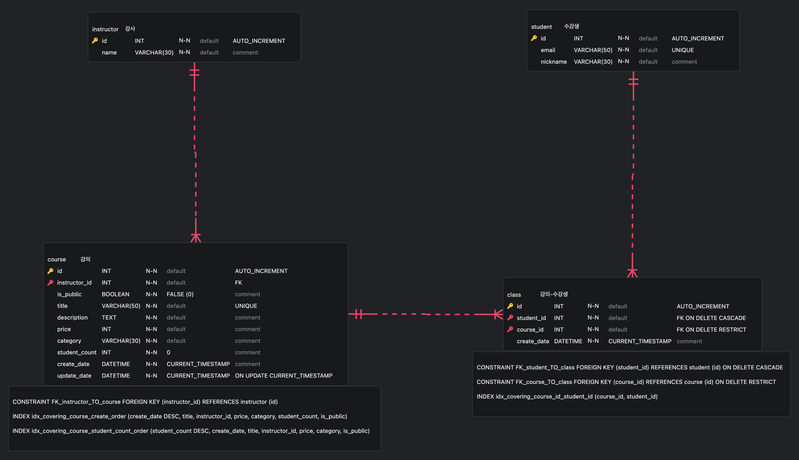

# [2024] 인프런 백엔드 (Node.js) 기술 과제 - 김영명

## 실행 방법

Docker desktop 또는 Docker 실행 상태 프로젝트 디렉토리의 터미널에서 `docker-compose up -d` 를 입력하면 1개의 Image, 3개의 Container가 생성됩니다.

### Container

- youngmyung-Nodejs-Express: **<Port 3000>** Nodejs API 서버입니다.
- youngmyung-mysql: **<Port 3306>** MySQL 서버입니다.
- youngmyung-mysql-test: **<Port 3307>** Test code 실행을 위한 MySQL 서버입니다.

> Test code를 실행하기 위해서는 docker-compose 후 `npm i`를 입력하고 `npm test`를 입력해주세요.
>
> mysql, mysql-test 모두 강사(instructor) 테이블은 9개의 테스트 데이터가 들어있습니다 (id = 1 ~ 9).

## 기술 스택

- NodeJS (TypeScript)
- Express
- MySQL
- mysql2
- TSyringe
- ts-node-dev
- class-validator
- express-validator
- class-transformer
- Jest / ts-jest
- ts-mockito
- supertest
- Winston

## 설계 방향

프로젝트를 설계할때 레이어드 아키텍처로 구성하였습니다. 이때 dto를 사용하여 요청과 응답이 계층간 단방향으로 이동할 수 있도록 구현했습니다.

- Presentation layer - Router, Controller
- Application/Business layer - Service
- Persistence layer - Repository
- Database layer - MySQL

이로써 계층과 관심사를 분리하여 각자의 역할을 수행하도록 하고, 각 계층 사이의 의존성을 줄였습니다. <br>
Presentation layer를 통해 요청을 받아 입력값을 검증 후 Application layer가 비즈니스 로직에 집중할 수 있도록 하였습니다.<br>
특정 데이터에 접근하는 같은 쿼리를 다른 서비스들이 사용할 수 있어 코드의 재사용성을 위해 Persistence layer만 DB와 상호작용하도록 설계했습니다.<br>
프로젝트의 크기가 아직 작으며 크게 복잡하지 않고, DI 패턴과 어울리는 효율적인 아키텍처라고 생각하여 현재 제 상황에 잘 맞는 설계라고 생각하여 선택하였습니다.<br>
또한, 이런 구조와 DI 패턴으로 인해 의존성이 줄어든 만큼 단위 테스트 코드를 보다 유연하게 작성할 수 있는 것을 느낄 수 있었습니다.

## 구현 과정 및 고민들

- _프로젝트 시작 시 각종 기능 로딩, MySQL Pool 생성 확인 방법 고민_

  > 현재 NodeJS + Express 구조로는 제가 평소에 사용하던 SpringBoot와 같이 설정들을 자동으로 잡아주지 않는다는 것을 해결하기 위해 고민했습니다. <br>
  > 그 결과 서버를 시작하는 server.ts를 두고 이에 필요한 DI container 초기화, express app 생성 등을 진행하고 3000포트를 listen하도록 설정했습니다. <br>
  > 효율적인 DB connection을 위해 서버 초기화 시 MySQL Pool 인스턴스를 생성하여 container에 등록하고, repository에서 해당 인스턴스를 이용하여 query를 실행하도록 구현했습니다.

- _최대한 에러 이유를 클라이언트에게 전달해주기. 내부 에러는 노출하지 않기_

  > 백엔드 개발자의 구현 능력도 정말 중요하지만 에러를 잘 다루고 찾아내는 것도 그만큼 중요하다고 생각합니다. <br>
  > 서비스 및 서버의 장애 대응은 물론이고, 다른 백엔드, 프론트엔드, 데브옵스 등의 팀들과의 협업에도 큰 영향을 준다고 생각하기 때문입니다. <br>
  > 따라서 잘못된 요청이나 내부 서버의 에러 등을 커스텀 에러를 통해 세분화하고, 보안을 위해 내부 에러 스택은 노출되지 않도록하며, 각 에러에 따른 메시지를 출력할 수 있도록 구현했습니다. <br>
  > 간혹 에러를 catch 후 다시 throw 할때 기존 에러 스택이 사라지는 현상을 발견하여 이를 방지하기 위해 스택을 계속 축적하도록 하였습니다.<br>
  > 에러를 추적하기 위한 로그도 필수라고 생각하여 Winston 라이브러리를 통해 로그 수집도 도입하였습니다.

- _반복 되는 DB try-catch-finally 하나로 -> 고차 함수 사용_

  > Repository에서 connection을 생성 후 쿼리를 수행하고, 다시 release하는 작업이 try-catch-finally로 모든 메서드에서 반복되어 이를 줄일 수 있는 방법을 고민했습니다. <br>
  > 함수형 프로그래밍의 특징을 지닌 자바스크립트에서 함수를 파라미터로 전달받거나 연산의 결과로 반환해주는 메서드인 고차 함수를 이용하여 해결했습니다. [mysqlUtil.ts](./src/core/util/mysqlUtil.ts) <br>
  > 해당 파일에는 트랜잭션이 있는 쿼리와 없는 쿼리로 메서드를 구분하여 구현했습니다.

- _포괄적인 에러 핸들링과 비동기 에러_

  > 포괄적인 에러 핸들링 설정을 직접 수행하지 않는 경우 내장된 기본 에러 핸들러가 호출되고 스택 스레이스를 반한하여 외부에 노출됩니다. <br>
  > 따라서 `app.use((err, req, res, next))`를 이용하여 포괄적인 에러 핸들링을 직접 설정했습니다. <br>
  > 하지만 이것으로는 비동기 에러를 잡지 못하는 문제가 있었습니다. try-catch로 해결 할 수 있지만 이것도 반복되어 공통화가 필요하다고 생각했습니다. <br>
  > 따라서 router에서 controller로 요청을 넘겨주기 전에 wrapAPI 함수를 만들어 해당 함수를 감싸서 보내도록 구현하였습니다. [wrapAsync.ts](./src/core/util/wrapAsync.ts)<br>
  > 그 결과 비동기 에러가 발생해도 함수를 통해 포괄적인 에러 핸들링으로 갈 수 있도록 유도했습니다.

- _기존 다른 repository의 여러 메소드를 사용할 때 트랜잭션 처리_

  > Repository 내의 하나의 메소드에서 트랜잭션을 사용하는 것이 아닌, 서비스에서 여러 repository를 한번에 이용할때 트랜잭션을 어떻게 처리할지 고민했습니다. <br>
  > 그러기 위해서는 service에서 connection을 생성하고, 위에서 구현한 고차 함수를 이용하여 트랜잭션을 사용하도록 했습니다. <br>
  > Service에서 시작한 connection은 repository에서도 유지 되도록 parameter를 만들고 분기 처리를 하여, 해당 repository 메서드가 새로운 connection이 필요한지 불필요한지 구분하도록 했습니다.
  >
  > ```
  > public async deleteAllByStudentId(
  > id: number,
  >  prevConnection?: PoolConnection,
  > ): Promise<void> {
  >  const sql = 'DELETE FROM class WHERE id = ?;';
  >  const value = [id];
  >
  > if (!prevConnection) {
  >   const connection = await this.mysqlPool.getConnection();
  >
  >   return await executeQuery(connection, async () => {
  >     await connection.query<ResultSetHeader>(sql, value);
  >   });
  > } else {
  >   await prevConnection.query<ResultSetHeader>(sql, value);
  >   }
  > }
  > ```

- _강의를 오픈, 수정, 삭제할때 (select ~ where id = ? and ins_id ?)로 안하고 id만으로 course를 먼저 find 하기_

  > 강의를 오픈, 수정, 삭제를 하기 위해서 위와 같은 쿼리로 한번에 실행하여 성공 또는 실패를 반환할 수도 있었습니다. <br>
  > 그러나 이 방법으로 진행하면 테이블을 찾을 수 없을때 강의의 존재 유무, 요청자가 해당 강의의 강사가 아닌지를 정확히 확인 할 수 없었습니다. <br>
  > 따라서 먼저 강의를 id로 찾고 순차적으로 강사를 검증하는 방법으로 구현했습니다.

- _Course table 강의 소개 Data type - VARCHAR(65535) or TEXT?_

  > 강의 소개는 길이가 클수 있어 해당 데이터 타입을 어떤 것으로 설정할지 고민하며 이 두개의 차이를 알아보았습니다. <br>
  > 레코드에는 최대 사이즈가 설정되어 있고, VARCHAR는 테이블의 다른 칼럼들이 사용할 수 있는 최대 공간의 크기에 영향을 줄 수 있습니다. <br>
  > 하지만 TEXT는 특정 임계치가 넘으면 InnoDB의 Off-page 방식을 통해 레코드와 별도의 공간에 저장되어 레코드에는 9~12 바이트 밖에 차지하지 않습니다. <br>
  > 따라서 추후 확장성을 생각하여 TEXT를 사용하기로 결정했습니다.
  > <br> https://dev.mysql.com/doc/refman/8.0/en/column-count-limit.html#row-size-limits

- _강의 목록 조회 - Covering Index 적용_

  > 해당 서비스의 특성상, 보통의 서비스가 그렇듯이 쓰기보다는 읽기가 주로 이루어질 것이라고 예상이 되었습니다. <br>
  > 또한 여기에 페이징 기능까지 있어 검색 성능을 개선하는 방법을 생각해보았고, 검색 시 인덱스를 적용해보고자 했습니다. <br>
  > 먼저 No offset을 생각해보았습니다. 하지만 이는 무한 스크롤에 적합하고, 순차적으로 다음페이지 이동만 가능하여 일반적인 페이징 버튼은 사용하지 못한다는 점이 있었습니다. <br>
  > 프로젝트의 서비스를 생각 했을때, 이는 적합하지 않다고 생각하였습니다. <br>
  > 기존 페이징 기능을 유지하면서 검색 성능을 개선하기 위해 커버링 인덱스를 적용하고자 했습니다. 즉 select, where, order by, group by 등 사용되는 모든 칼럼이 index 칼럼에 포함되도록 했습니다. <br>

- _강의 목록 조회 - Covering Index, using temporary, using filesort 해결_

  > 인덱스를 생성하고 EXPLAIN으로 확인한 결과, extra에 `using temporary, using filesort`가 출력되었고 커버링 인덱스가 제대로 작동하지 않는다는 것을 확인했습니다. <br>
  > 초기 데이터베이스에서 강의 테이블에는 학생수가 있지 않았고, `count(cl.id) as student_id`로 인해 이런 현상이 있다는 것을 알게 되었습니다. <br>
  > 이를 해결하기 위해 제가 처음에 설계했던 데이터베이스에서 강의가 학생수를 class(강의-수강생 mapping table)의 갯수로 세는 것에서 칼럼으로 가지도록 변경했습니다. <br>
  > 그 후 이에 필요한 인덱스를 생성하고, EXPLAIN을 통해 'Using Index'로 커버링 인덱스가 잘 수행되는 것을 확인했습니다.

- _강의 목록 조회 - Covering Index, Backward Index Scan_

  > 최신순, 수강생수 정렬을 하는 커버링 인덱스를 위해 (group by, order by 순서 때문에) 날짜가 맨 앞에 있는 인덱스와, 수강생 수가 맨 앞에 인덱스를 만들어 놓았습니다. <br>
  > 그러나 최신순이나 수강생수와 반대로 인덱스는 오름차순으로 정렬되어 backward index scan이 발생하는 것을 확인했습니다. <br>
  > 하지만 InnoDB에서는 페이지 잠금이 forward index에 적합한 구조이고, Double linked list로 연결된 B-Tree의 리프 페이지 구조와는 달리 페이지 내에서 인덱스 레코드가 단방향으로만 연결되어 backward index scan이 forward index scan에 비해 느릴 수 밖에 없습니다. <br>
  > Forward Index scan을 유도하기 위해서 각각 맨 앞의 인덱스를 Descending Index로 구성했습니다. <br> > `INDEX idx_covering_course_create_order (create_date DESC, title, instructor_id, price, category, student_count, is_public),` <br> > `INDEX idx_covering_course_student_count_order (student_count DESC, create_date, title, instructor_id, price, category, is_public)`

- _테스트 코드 작성_

  > 테스트 코드를 작성함으로써 입력값들을 검증하고, 예기치 못한 작동을 미리 방지할 수 있어 이는 필수라고 생각합니다. <br>
  > 특히 저에게는 이를 포함하여, 다음 두가지가 테스트 코드를 작성하게 되는 원동력이 됩니다. <br>
  > 첫번째는 리팩토링을 보다 더 안전하고 확실하게 가능하도록 한다는 것입니다. 테스트 코드는 구현 과정이 아닌 결과를 검증하는 것이기 때문에, 코드를 리팩토링 해도 결과가 달라지지 않는 이상 항상 통과해야만 합니다. 따라서 리팩토링 후 기존 테스트 코드가 통과하면 잘 이루어졌다는 것을 바로 알 수 있습니다. <br>
  > 두번째는 코드를 새로 보는 사람들의 가이드가 될 수 있다는 것입니다. 원래의 코드만 보아서는 어떤 형식의 데이터가 들어가고 반환이 되야하는지 한눈에 보기 어렵지만, 테스트 코드에서는 예시를 통해(given, then) 명확하게 어떤 데이터가 들어가고 반환되는지 명시하기 때문에 많은 도움이 된다고 생각합니다. <br>
  > 그 결과 이번 과제에서 서버의 전체적인 동작을 확인할 수 있는 통합 테스트와, 비즈니스 로직만 빠르게 검증할 수 있는 단위 테스트를 최대한 작성했습니다.

###

## ERD

</img><br/>

## API

### **강의 목록 조회**

```
http://localhost:3000/courses/search?type={}&keyword={}&category={}&pageNumber={}&pageSize{}&sort={}

URL query string를 통해 검색어 일치 / 포함 하는 공개 상태인 강의들을 조회할 수 있습니다.

(강사명 / 강의명) 또는 (수강생 id)를 검색어로해서 검색이 가능합니다.
강의 카테고리는 all(전체 카테고리), web, app, game, algorithm, infra, database 를 검색 조건으로 사용합니다.
검색 결과는 최신순 / 수강생수로 정렬 되도록 조건을 설정할 수 있습니다.
페이징이 가능하여 원하는 페이지 시작과 크기를 설정할 수 있습니다.
모든 query string은 입력해 주어야 하며, 형식이 맞지 않을 경우 에러를 반환합니다.

EX) <GET> http://localhost:3000/courses/search?type=instructorAndTitle&keyword=Node&category=web&pageNumber=1&pageSize=10&sort=recent

```

**요청 (GET)**

- 검색 조건 - `type` (string)

  - 강사명 / 강의명으로 검색: `instructorAndTitle`
  - 수강생 id 검색: `studentId`

- 검색 단어 - `keyword` (string) or (integer)

  - 조건에 따른 검색어

- 카테고리 - `category` (string)

  - 전체: `all`
  - 웹: `web`
  - 앱: `app`
  - 게임: `game`
  - 알고리즘: `algorithm`
  - 인프라: `infra`
  - 데이터베이스: `database`

- 페이지 번호 - `pageNumber` (integer)

  - 페이지 크기에 따라 몇 번째 페이지를 나타내는지

- 페이지 크기 - `pageSize` (integer)

  - 검색 시 목록의 크기

- 정렬 조건 - `sort` (string)
  - 최신순: `recent`
  - 수강생순: `student-count`

**응답**

```
{
  "courses": [
      {
          "id": 3,
          "category": "웹",
          "title": "NodeJs와 Express",
          "instructorName": "김영명",
          "price": 13000,
          "studentCount": 0,
          "publishedOn": "2024-09-01 15:59:32"
      },
      {
          "id": 1,
          "category": "웹",
          "title": "이것이 NodeJs다",
          "instructorName": "향로",
          "price": 65000,
          "studentCount": 2,
          "publishedOn": "2024-09-01 15:56:39"
      }
      ...
  ]
}

```

---

### **강의 상세 조회**

```
http://localhost:3000/courses/{}

Path parameter로 강의 id를 입력하여 공개 / 비공개 강의를 상세 조회할 수 있습니다.

Path parameter의 형식이 맞지 않으면 에러를 반환합니다.

EX) <GET> http://localhost:3000/courses/2
```

**요청 (GET)**

- 강의 id - (integer)

**응답**

```
{
    "title": "이것이 NodeJs다",
    "description": "강의 소개란 입니다.",
    "category": "웹",
    "price": 65000,
    "studentCount": 2,
    "students": [
        {
            "nickname": "aaa",
            "appliedOn": "2024-09-01 15:57:27"
        },
        {
            "nickname": "spring",
            "appliedOn": "2024-09-01 16:11:47"
        }
    ],
    "publishedOn": "2024-09-01 15:56:39",
    "updatedOn": "2024-09-01 16:11:47"
}
```

---

### **강의 등록**

```
http://localhost:3000/courses

강의를 등록하며 처음 생성시 자동으로 비공개 상태로 저장됩니다.

존재하지 않는 강사, 중복된 강의명, 형식에 맞지 않는 값을 입력하는 경우 에러를 반환합니다.

EX) <POST> http://localhost:3000/courses
```

**요청 (POST)**

```
{
    "instructorId": 2,
    "title": "NodeJs와 Express",
    "description": "익스프레스를 적용하자",
    "price": 13000,
    "category": "웹"
}

```

- 강사 id - `instructorId` (integer)
- 제목 - `title` (string)
- 강의 소개 - `description` (string)
- 가격 - `price` (integer)
- 카테고리 - `category` (string)

**응답**

```
{
    "insertedCourseId": 3
}
```

- 등록된 강의 id - `insertedCourseId`

---

### **강의 대량 등록**

```
http://localhost:3000/courses/bulk

강의 등록과 동일하지만 하나의 강사 id로 1개 이상 최대 10개까지 강의를 동시에 등록할 수 있습니다.

모든 강사 id가 동일하지 않거나, 중복된 강의명, 존재하지 않는 강사, 형식에 맞지 않는 값을 입력하는 경우 에러를 반환합니다.

EX) <POST> http://localhost:3000/courses/bulk

```

**요청 (POST)**

```
{
    "courses": [
        {
            "instructorId": 7,
            "title": "CS",
            "description": "Computer Science",
            "price": 6700,
            "category": "인프라"
        },
        {
            "instructorId": 7,
            "title": "Redis란",
            "description": "캐시가 없었다면",
            "price": 8000,
            "category": "데이터베이스"
        }
    ]
}
```

**응답**

```
{
    "insertedCourseIds": [
        4,
        5
    ]
}
```

---

### **강의 수정**

```
http://localhost:3000/courses/{}

해당 강사가 강의를 수정할 수 있습니다.

존재하지 않는 강의, 일치하지 않는 강사, 중복된 강의명, 형식에 맞지 않는 값을 입력하는 경우 에러를 반환합니다.

EX) <PUT> http://localhost:3000/courses/2
```

**요청 (PUT)**

- 강의 id - (integer)

```
{
    "instructorId": 2,
    "title": "새로운 강의명",
    "description": "바뀐 소개입니다.",
    "price": 12000
}
```

**응답**

```
{
    "updatedCourseId": 2
}
```

- 수정된 강의 id - `updatedCourseId`

---

### **강의 오픈**

```
http://localhost:3000/courses/open/{}

Path parameter로 강의 id를 입력하여 해당 강사가 강의를 오픈할 수 있습니다.

존재하지 않는 강의, 일치하지 않는 강사, 이미 오픈된 강의, 형식에 맞지 않는 값을 입력하는 경우 에러를 반환합니다.

EX) <PUT> http://localhost:3000/courses/open/3
```

**요청 (PUT)**

- 강의 id - (integer)

```
{
    "instructorId": 2
}
```

**응답**

```
{
    "openedCourseId": 3
}
```

- 오픈된 강의 id - `openedCourseId`

---

### **강의 삭제**

```
http://localhost:3000/courses/{}

Path parameter로 강의 id를 입력하여 해당 강사가 강의를 삭제할 수 있습니다.

존재하지 않는 강의, 일치하지 않는 강사, 수강생이 있는 강의, 형식에 맞지 않는 값을 입력하는 경우 에러를 반환합니다.

EX) <DELETE> http://localhost:3000/courses/5
```

**요청 (DELETE)**

- 강의 id - (integer)

```
{
    "instructorId": 7
}
```

**응답**

```
{
    "deletedCourseId": 5
}
```

- 삭제된 강의 id - `deletedCourseId`

---

### **수강생 (회원) 가입**

```
http://localhost:3000/students

이메일과 닉네임으로 수강생 회원 가입을 합니다.

중복된 이메일, 형식에 맞지 않는 값을 입력하는 경우 에러를 반환합니다.

EX) <POST> http://localhost:3000/students
```

**요청 (POST)**

```
{
    "email": "rladud@gmail.com",
    "nickname": "spring"
}
```

**응답**

```
{
    "signUpId": 4
}
```

- 가입된 수강생 id - `signUpId`

---

### **수강생 (회원) 탈퇴**

```
http://localhost:3000/students/{}

Path parameter로 수강생 id를 입력하여 탈퇴를 할 수 있습니다.

탈퇴 동시에 수강생의 수강 내역이 삭제되며 그 이메일은 다른 사용자가 재사용이 가능합니다.

존재하지 않는 수강생, 형식에 맞지 않는 값을 입력하는 경우 에러를 반환합니다.

EX) <DELETE> http://localhost:3000/students/4
```

**요청 (DELETE)**

- 수강생 id - (integer)

**응답**

```
{
    "removedStudentId": 4
}
```

- 탈퇴된 수강생 id - `removedStudentId`

---

### **강의 수강 신청**

```
http://localhost:3000/students/apply-class

가입된 수강생으로 1~N 개의 강의 id들을 통해 공개된 강의를 동시에 수강신청할 수 있습니다.

요청에 포함된 강의들은 각각 신청을 성공하거나 실패 시 응답으로 이유를 알려줍니다.

EX) <POST> http://localhost:3000/students/apply-class
```

**요청 (POST)**

```
{
    "studentId": 7,
    "courseIds": [1, 2, 3, 4, 5, 6, 7]
}
```

**응답**

```
{
    "createdClassIds": [
        3,
        4,
        5
    ],
    "alreadyAppliedCourseIds": [],
    "appliedCourseIds": [
        3,
        2,
        1
    ],
    "noExistCourseIds": [
        5,
        6
    ],
    "noPublicCourseIds": [
        7,
        4
    ]
}
```

- 신청 성공하여 생성된 수강 내역 id 리스트- 'createdClassIds'
- 이미 수강중인 강의 id 리스트- 'alreadyAppliedCourseIds'
- 신청 선공한 강의 id 리스트 - 'appliedCourseIds'
- 존재하지 않아 신청하지 못한 강의 id 리스트- 'noExistCourseIds'
- 비공개 상태로 신청하지 못한 강의 id 리스트- 'createdClassIds'

---
